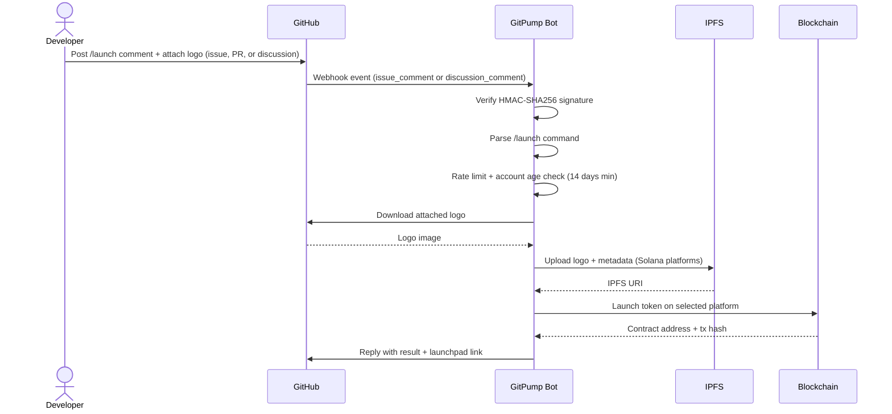

<div align="center">
  

  <h1>GitPump</h1>

  <p>
    
    
    
    
    
    
    
  </p>

  <p><strong>Launch tokens on Pump.fun, Bags.fm, Clanker, and Four.meme directly from a GitHub issue, pull request, or discussion comment.</strong></p>
</div>

---

GitPump is a GitHub-native token launchpad. Post a `/launch` command in any GitHub issue, pull request comment, or discussion, attach a logo image, and the bot handles everything — wallet management, IPFS upload, on-chain transaction, and confirmation reply.

It works across four platforms on three blockchains: **Pump.fun** and **Bags.fm** on Solana, **Clanker** on Base, and **Four.meme** on BSC.

---

## How It Works

```
/launch name=YourToken symbol=TICKER platform=pumpfun
description=Your token description here
twitter=https://x.com/yourhandle
telegram=https://t.me/yourchannel
website=https://yoursite.com
```

Attach your token logo image to the comment. That's it.

1. Post a `/launch` comment on any issue, PR, or discussion in a repo with GitPump installed
2. GitPump verifies the signature, checks rate limits and account age, parses the command
3. The bot downloads your logo, uploads it to IPFS (for Solana platforms), and executes the on-chain launch
4. A reply is posted with the contract address and a direct link to the token on its launchpad
5. The launch appears instantly on the public live feed at [gitpump.com](https://gitpump.com)

---

## Supported Platforms

| Platform | Blockchain | Command value | Symbol limit |
|---|---|---|---|
| Pump.fun | Solana mainnet | `platform=pumpfun` | 10 chars |
| Bags.fm | Solana mainnet | `platform=bags` | 9 chars |
| Clanker | Base (ETH L2) | `platform=clanker` | 10 chars |
| Four.meme | BSC (BNB Chain) | `platform=fourmeme` | 10 chars |

You can also use `chain=` as an alias for `platform=`.

---

## Flow Overview



---

## Where You Can Use It

GitPump responds to `/launch` commands in:

- **Issues** — standard GitHub issue comments
- **Pull Requests** — comments on the PR conversation thread
- **Discussions** — comments in GitHub Discussions (requires `discussion_comment` webhook event subscription)

---

## Rules

- One launch per GitHub account per hour
- GitHub account must be at least 14 days old
- Logo image is required (PNG, JPG, GIF, WEBP — max 15 MB)
- Description is required
- Token name and symbol are permanent once launched

---

## Commands

### /launch

```
/launch name=YourToken symbol=TICKER platform=pumpfun
description=A short token description (max 200 chars)
twitter=https://x.com/yourhandle
telegram=https://t.me/yourchannel
website=https://yoursite.com
```

### /claim

```
/claim 0xYourWalletAddress
```

Sweeps accumulated creator fees from Clanker (Base) and Four.meme (BSC) launches to your wallet. 75% to you, 25% to GitPump.

### /point

```
/point
```

Displays your GitPump Points balance. Points are earned from trading volume on your launched tokens and can be redeemed for GitPump rewards and airdrop allocation.

---

## Architecture

| Layer | Component | Role |
|---|---|---|
| Entry | GitHub issue / PR / Discussion | User posts `/launch` command |
| Gateway | GitPump Bot (Express + TypeScript) | Receives webhook, verifies HMAC-SHA256 signature |
| Processing | Command Parser | Extracts and validates launch parameters |
| Storage | IPFS | Stores logo and metadata (Solana platforms) |
| Execution | Pump.fun, Bags.fm, Clanker, Four.meme APIs | Deploys token on-chain |
| Database | PostgreSQL + Drizzle ORM | Stores launch history and user points |
| Frontend | React + Vite (gitpump.com) | Live launch feed and docs |

---

## Installation (GitHub App)

1. Visit [github.com/apps/gitpump-bot](https://github.com/apps/gitpump-bot)
2. Click **Install** and select your repository
3. Post a `/launch` comment — the bot responds within seconds

---

## Self-Hosting

The full stack is open source. You can run your own instance with your own wallets.

| Package | Path | Description |
|---|---|---|
| `@workspace/api-server` | `artifacts/api-server` | Express bot + webhook handlers |
| `@workspace/landing` | `artifacts/landing` | React + Vite frontend (gitpump.com) |
| `@workspace/db` | `lib/db` | Drizzle ORM schema + migrations |

Required environment variables: `GITHUB_TOKEN`, `GITHUB_WEBHOOK_SECRET`, `GITHUB_APP_ID`, `GITHUB_APP_PRIVATE_KEY`, `GITHUB_APP_WEBHOOK_SECRET`, `DATABASE_URL`, and platform-specific wallet keys.

---

## Points System

Every launch earns GitPump Points:

- Install the GitHub App: **+100 bonus points**
- $1,000 in trading volume on your token: **+1 point**
- Check balance anytime: comment `/point` on any issue, PR, or discussion

Points convert to GitPump Token rewards at launch.

---

<div align="center">
  <a href="https://gitpump.com">gitpump.com</a> &nbsp;|&nbsp;
  <a href="https://github.com/apps/gitpump-bot">Install the Bot</a> &nbsp;|&nbsp;
  <a href="https://gitpump.com/docs">Documentation</a>
</div>
