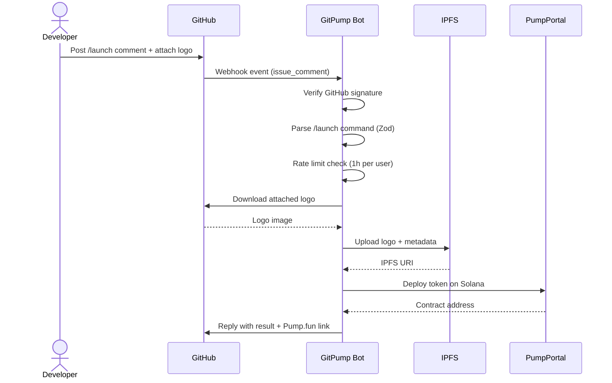

<div align="center">
  

  <h1>GitPump</h1>

  <p>
    
    
    
    
    
  </p>

  <p><strong>Launch on Pump.fun through GitHub. Built for responsible developers.</strong></p>
</div>

---

GitPump is a GitHub-native interface for launching tokens on Pump.fun.
Instead of random, manual launches, GitPump enables structured, command-based execution directly from GitHub.

It does not replace Pump.fun — it extends it.

---

## What is GitPump?

GitPump is a developer-first layer on top of Pump.fun that allows token launches via GitHub interactions such as issues and comments.

By introducing structure and traceable workflows, GitPump helps:

- Developers launch more responsibly
- Reduce random and misleading tokens
- Create a safer experience for buyers

---

## How It Works

A simple GitHub comment becomes a real token launch.

```
/launch name=YourToken symbol=TICKER
```

1. Open an issue in the [GitPump repo](https://github.com/git-pump/gitpump)
2. Post a `/launch` command with your token details
3. The GitPump bot validates input, uploads your logo to IPFS, and deploys on Pump.fun
4. Bot replies with the result and a direct link

---

## Flow Overview



---

## Why GitPump?

Pump.fun is powerful, but launching is often:

- Random
- Unstructured
- Anonymous
- Easy to abuse

GitPump introduces:

- Structured workflows
- Developer accountability
- Transparent execution
- Reduced noise

---

## Built for Responsible Developers

GitPump is designed for developers who understand the impact of launching tokens.

- No blind launches
- No spam deployment
- No anonymous chaos

Every launch is tied to a GitHub identity.

---

## Core Principles

**1. Structure over randomness**
Launches should follow a clear process, not impulsive clicks.

**2. Developer accountability**
Actions are tied to GitHub identities, not anonymous wallets.

**3. Buyer protection**
Reducing misleading or low-effort tokens improves trust.

**4. Minimal friction, maximum clarity**
Simple commands, powerful outcomes.

---

## Example Command

```
/launch
name=MyToken
symbol=MTK
description=Example token
twitter=https://x.com/example
telegram=https://t.me/example
website=https://example.com
```

Attach your token logo image directly to the GitHub comment.

---

## Architecture Overview

| Layer | Component | Role |
|---|---|---|
| Entry | GitHub Issue / Comment | User posts `/launch` command |
| Gateway | GitPump Bot (Express) | Receives webhook, verifies signature |
| Processing | Command Parser + Zod | Extracts and validates launch params |
| Storage | IPFS (nft.storage) | Stores logo and metadata |
| Execution | PumpPortal API | Deploys token on Solana |
| Database | PostgreSQL + Drizzle ORM | Stores launch history |
| Frontend | React + Vite (gitpump.com) | Live launch feed |

---

## Components

| Component | Description |
|---|---|
| GitHub Interface | Issues and comments as the command layer |
| GitPump Bot | Listens and executes commands |
| Parser Engine | Extracts structured input from comments |
| Validation Layer | Ensures correctness before execution |
| Execution Layer | Integrates with Pump.fun API |
| IPFS Storage | Handles assets (logo, metadata) |

---

## Repositories

| Repo | Description |
|---|---|
| `app` | Web dashboard and launch explorer |
| `api` | Backend services and bot execution |
| `docs` | Documentation and guides |

---

## Vision

GitPump aims to redefine how tokens are launched.

**From:** Fast, anonymous, and chaotic

**To:** Structured, intentional, and developer-driven

---

## Trust & Safety

GitPump does not eliminate risk, but it improves:

- Transparency
- Accountability
- Signal vs noise ratio

---

## Status

- Actively in development
- Early-stage infrastructure
- Iterating on launch flow

---

## Contributing

We welcome developers who believe in:

- Responsible token creation
- Better on-chain experiences
- Reducing noise in crypto ecosystems

---

## Join the Movement

GitPump is not about launching faster.

It's about launching better.

---

<div align="center">
  <a href="https://gitpump.com">gitpump.com</a> &nbsp;|&nbsp;
  <a href="https://github.com/git-pump/gitpump/issues">Launch Now</a>
</div>
